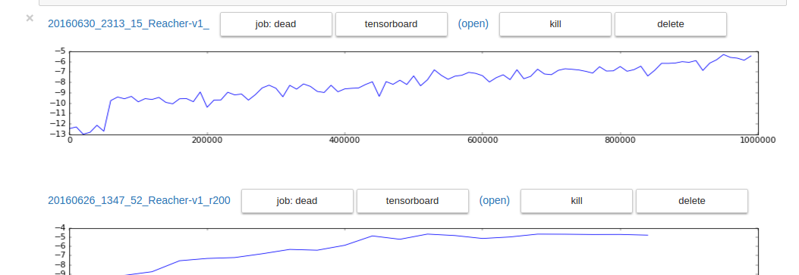

# Deep Deterministic Policy Gradient

__Warning: This repo is no longer maintained. For a more recent (and improved) implementation of DDPG see https://github.com/openai/baselines/tree/master/baselines/ddpg .__

Paper: ["Continuous control with deep reinforcement learning" - TP Lillicrap, JJ Hunt et al., 2015](http://arxiv.org/abs/1509.02971)

<table>
  <tr>
    <td></td>
    <td></td>
    <td></td>
  </tr>
</table>

### Installation
Install [Gym](https://github.com/openai/gym#installation) and [TensorFlow](https://www.tensorflow.org/versions/r0.9/get_started/os_setup.html). Then:

```bash
pip install pyglet # required for gym rendering
pip install jupyter # required only for visualization (see below)

git clone https://github.com/SimonRamstedt/ddpg.git # get ddpg
```

### Usage
Example:
```bash
python run.py --outdir ../ddpg-results/experiment1 --env InvertedDoublePendulum-v1
```
Enter `python run.py -h` to get a complete overview.

If you want to run in the cloud or a university cluster [this](https://github.com/SimonRamstedt/ddpg-darmstadt) might contain additional information.

### Visualization



Example:
```bash
python dashboard.py --exdir ../ddpg-results/+
```
Enter `python dashboard.py -h` to get a complete overview.

### Known issues
- No batch normalization yet
- No conv nets yet (i.e. only learning from low dimensional states)
- No proper seeding for reproducibilty

*Please write me or open a github issue if you encounter problems! Contributions are welcome!*

### Improvements beyond the original paper
- [Output normalization](http://www0.cs.ucl.ac.uk/staff/d.silver/web/Publications_files/popart.pdf) – the main reason for divergence are variations in return scales. Output normalization would probably solve this.
- [Prioritized experience replay](http://arxiv.org/abs/1511.05952) – faster learning, better performance especially with sparse rewards – *Please write if you have/know of an implementation!*


### Advaned Usage
Remote execution:
```bash
python run.py --outdir your_username@remotehost.edu:/some/remote/directory/+ --env InvertedDoublePendulum-v1
```
